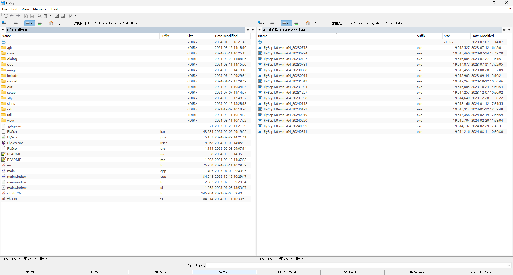
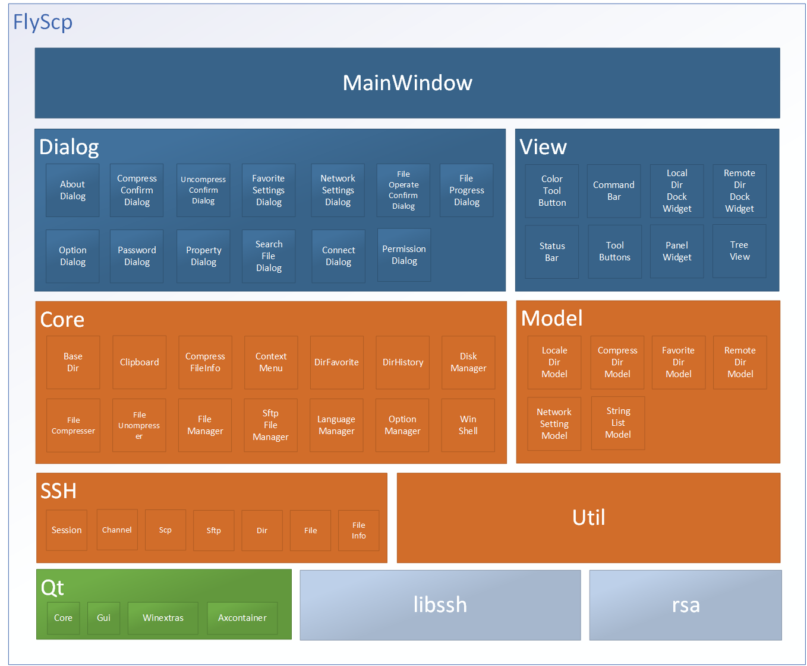

# FlyScp
A Windows Explorer developed based on Qt.

#### Description
Function List:
- Supports dual windows and multiple tab pages.
- Support command-line operations.
- Support folder favorites.
- Support file browsing history.
- Support file search operations.
- Support desktop folders.
- SSH configuration encryption save.
- Support text file viewing/editing operations(Using MobaTextEditor).
- Support file drag and drop operations, including dual window drag and drop and other application drag and drop operations.
- A concise right-click menu similar to Windows 11。
- Support remote file system sftp and scp。
- Support operations such as browsing, editing, modifying, and deleting compressed folders(Using 7zip)。
- Support file compression operations, including multi volume compression, self decompression(cmd and GUI) and encryption compression。
- Support file/folder comparison operations(Using MobaDiff).
- Interface supports both Chinese and English.
#### Software Architecture

#### Installation

1.  Run setup/release/Flyscp1.0-win-x64_202xxxxx.exe to setup.
2.  After installation, click on the FlyScp shortcut on the desktop to run it。