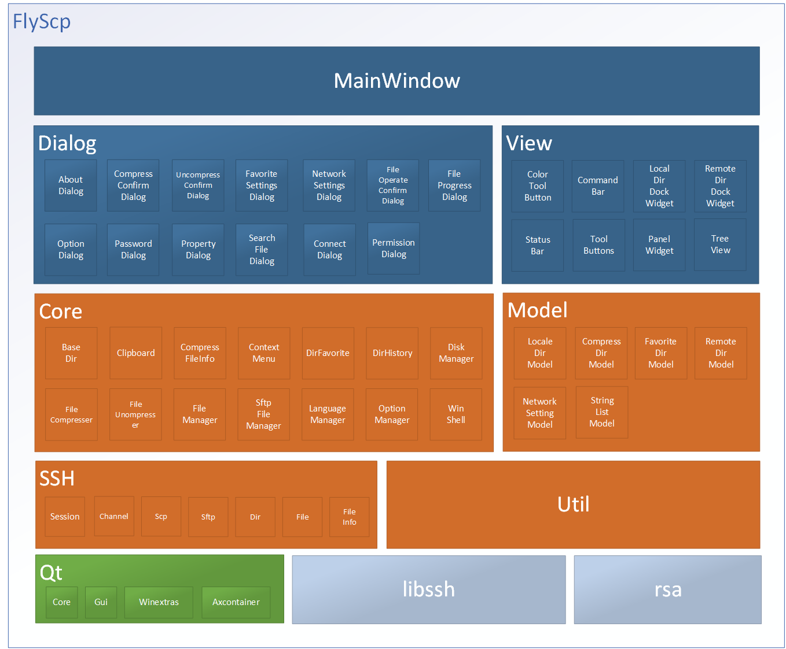

# FlyScp
一款基于Qt开发的Windows资源管理器。

#### 介绍
功能列表：
- 支持双窗口和多Tab页
- 支持命令行操作。 
- 支持文件夹收藏。
- 支持文件浏览历史。
- 支持文件搜索操作。
- 支持桌面文件夹。
- ssh配置加密保存。
- 支持文本文件查看/编辑操作(利用MobaTextEditor).
- 支持文件拖放操作，包括双窗口拖放及与其它应用拖放操作。
- 类似Windows11的简介右键菜单。
- 支持远程文件系统sftp及scp。
- 支持压缩文件夹浏览/编辑/修改/删除等操作(利用7zip)。
- 支持文件压缩操作，包括多卷压缩，自解压(命令行和GUI)和加密压缩。
- 支持文件/文件夹比较操作(利用MobaDiff)。
- 界面支持中英文。

#### 软件架构

#### 安装教程
1.  运行setup/release/Flyscp1.0-win-x64_202xxxxx.exe安装
2.  安装完毕在桌面上点击FlyScp快捷方式运行。
